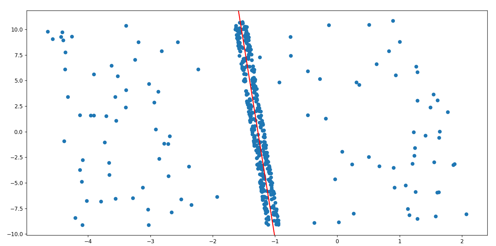
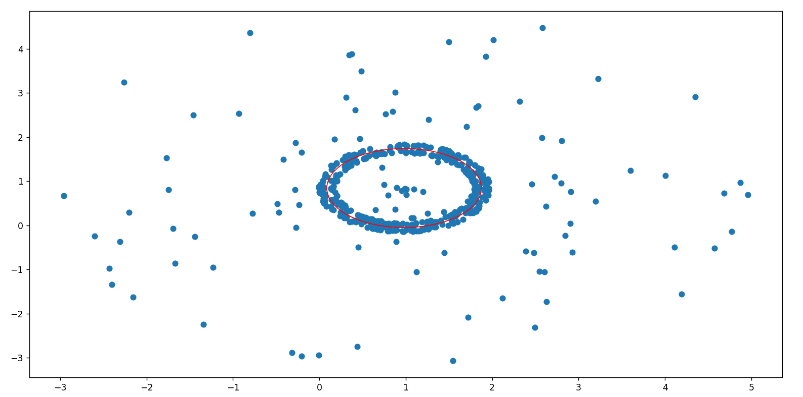
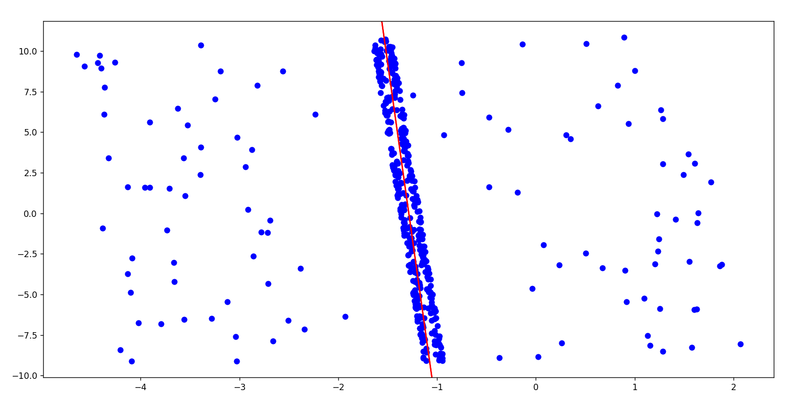
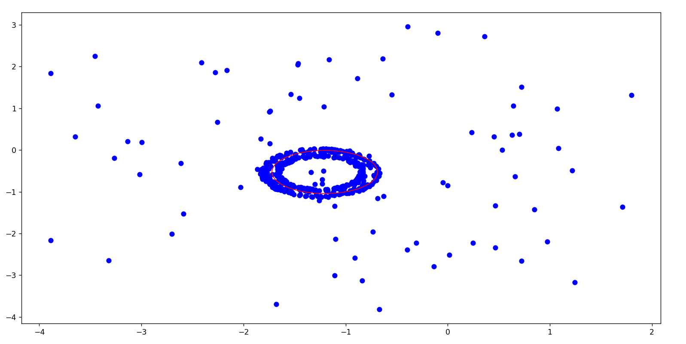
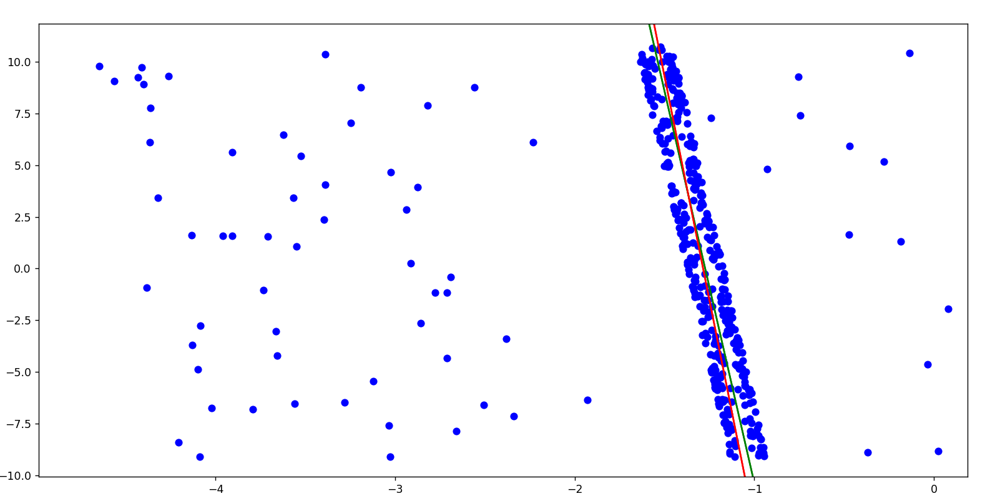
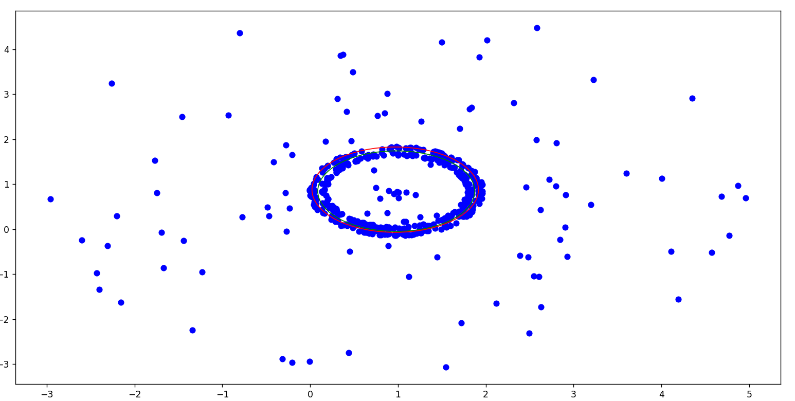

## Briefcam_Core_Project
# Synthetic data generation of geometries measurements and data Estimation
## There are 3 parts in this project
### 1. Generator - generate synthetic data with noise

### 2. Estimator - estimate from noise points the original shape

### 3. Tester - test the estimator results

# Install
##### Clone git project:
##### git clone https://github.com/brachahold/Briefcam_Core_Project.git
##### open cmd and cd Briefcam_Core_Project
##### create a clean virtual environment:
##### conda create --name briefcam-core-project python=3
##### conda activate briefcam-core-project
##### pip install -r requirements.txt

# Run
## Generator
##### python generator.py -c <PATH_TO_CONFIG_FILE> -o <PATH_TO_OUTPUT_FILE> -l <LIMIT>, -g
##### for more details(help) type: python generator.py -h

## Estimator
##### python estimator.py -i <PATH_TO_INPUT_FILE> -o <PATH_TO_OUTPUT_FILE> -it <ITERATION>, -g
##### for more details(help) type: python estimator.py -h

## Tester
##### python tester.py -gt <GROUND_TRUTH_INPUT_FILE> -est <ESTIMATE_INPUT_FILE>, -g
##### for more details(help) type: python tester.py -h

#### Note: for running in debug mode press -g and for release mode do nothing:) 
